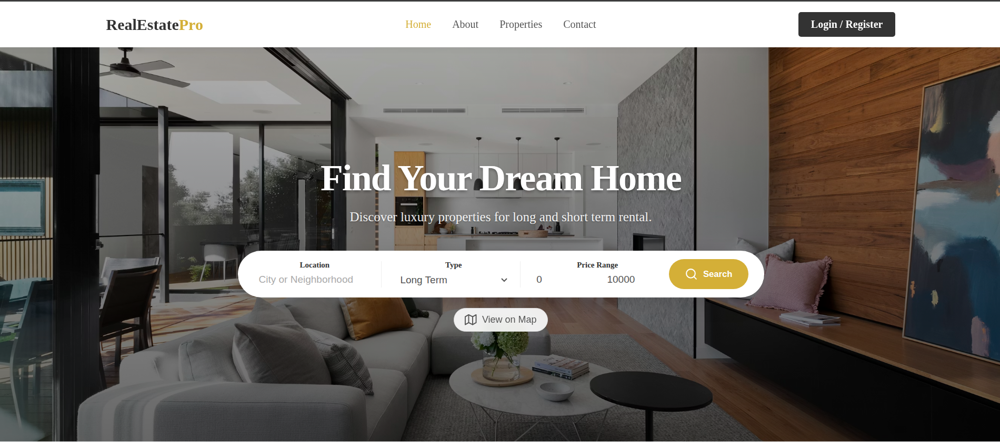

<div align="center">
  

  <h1>🏠 Decentralized Real Estate Rental Platform</h1>

  <p>
    <strong>A modern, hybrid platform bridging traditional real estate rental with the security and transparency of Blockchain technology.</strong>
  </p>

  <p>
    <a href="https://angular.io/" target="_blank">
      
    </a>
    <a href="https://nx.dev/" target="_blank">
      
    </a>
    <a href="https://ethereum.org/" target="_blank">
      
    </a>
    <a href="LICENSE">
      
    </a>
  </p>
</div>

---

## 📖 Project Presentation

The **Real Estate Rental Platform** is a cutting-edge solution designed to revolutionize the property rental market. By combining a robust **Microservices architecture** with **Blockchain smart contracts**, we offer a hybrid ecosystem that ensures transparency, security, and efficiency.

> [!NOTE]
> **Scope**: This repository contains the **Frontend** application built with **Angular** and **Nx**. It interacts with a **Java Spring Boot** backend (Microservices) for off-chain data and **Ethereum Smart Contracts** for on-chain transactions.

### Value Proposition
- **Transparency**: All rental agreements and transactions are immutable and verifiable on the blockchain.
- **Security**: Smart contracts automate payments and dispute resolutions, reducing fraud.
- **Efficiency**: A seamless user experience for listing, searching, and renting properties.

This project serves as a comprehensive demonstration of a **Web3-enabled Enterprise Application**, showcasing best practices in modern frontend development and blockchain integration.

---

## 📸 Application Preview

Experience a modern, responsive interface designed for both desktop and mobile users.

<div align="center">
  
</div>

*The main dashboard provides easy access to property listings, user profiles, and rental management.*

---

## ✨ Key Features

### 🏢 Property Management
- **Interactive Listings**: Browse properties with rich details and images.
- **Map Search**: Location-based search using **Leaflet** maps.
- **Owner Dashboard**: Create, edit, and manage property listings easily.

### 🔗 Blockchain Integration
- **Smart Rental Agreements**: Automatically generate and sign contracts on the Ethereum blockchain.
- **Crypto Payments**: Secure rent payments using Ether (ETH).
- **Decentralized Identity**: Wallet-based authentication and verification.

### 👤 User Experience
- **Responsive Design**: Fully optimized for desktop and mobile devices.
- **Real-time Notifications**: Instant updates on booking status and contract changes.
- **User Profiles**: Comprehensive dashboard for tenants and owners.

---

## 🏗️ Architecture

The project follows a **Hybrid Architecture** leveraging the best of Web2 and Web3:

```mermaid
graph TD
    User[User / Browser] -->|HTTPS| Frontend[Angular Frontend (Nx)]
    Frontend -->|REST API| Gateway[API Gateway]
    Gateway -->|HTTP| Microservices[Java Spring Boot Microservices]
    Frontend -->|JSON-RPC| Blockchain[Ethereum Blockchain]
    Blockchain -->|Events| Frontend
```

- **Frontend**: Built with **Angular 20** within an **Nx Monorepo**, ensuring modularity and scalability.
- **Backend**: A suite of **Java Spring Boot** microservices handling off-chain data (user profiles, property metadata).
- **Blockchain**: **Solidity** smart contracts on Ethereum for critical logic (agreements, payments).

---

## 🛠️ Technology Stack

### Frontend Core
- **Framework**: [Angular 20](https://angular.io/)
- **Build System**: [Nx](https://nx.dev/) & [Vite](https://vitejs.dev/)
- **Language**: [TypeScript 5.9](https://www.typescriptlang.org/)

### Web3 & Blockchain
- **Library**: [Ethers.js v6](https://docs.ethers.org/v6/)
- **Contracts**: Solidity (ABI integration)

### UI & Styling
- **Styling**: SCSS (Modular & Global)
- **Maps**: [Leaflet](https://leafletjs.com/)
- **Icons**: FontAwesome / Material Icons

### Testing & Quality
- **Unit Testing**: [Vitest](https://vitest.dev/)
- **Linting**: ESLint + Prettier

---

## 🚀 Getting Started

### Prerequisites

Ensure you have the following installed:
- **Node.js** (v18 or higher)
- **npm** or **yarn**
- **MetaMask** browser extension (for blockchain features)

### Installation

1. **Clone the repository:**
   ```bash
   git clone https://github.com/your-username/real-estate-rental.git
   cd real-estate-rental
   ```

2. **Install dependencies:**
   ```bash
   npm install
   ```

3. **Configure Environment:**
   Create a `.env` file or update `src/environments/environment.ts` with your API endpoints and Blockchain contract addresses.

### Usage

**Start the Development Server:**
```bash
npx nx serve public-app
```
Navigate to `http://localhost:4200/`. The app will automatically reload if you change any of the source files.

**Build for Production:**
```bash
npx nx build public-app
```
The build artifacts will be stored in the `dist/` directory.

---

## 📂 Project Structure

The project uses an **Nx Monorepo** structure:

```
frontend/
├── apps/
│   └── public-app/          # Main Angular Application
│       ├── src/
│       │   ├── app/
│       │   │   ├── core/    # Singleton services, guards, interceptors
│       │   │   ├── features/# Feature modules (Auth, Properties, Rentals)
│       │   │   ├── shared/  # Reusable components and pipes
│       │   │   └── contracts/# ABI and Contract Addresses
│       │   └── environments/# Environment configuration
├── packages/
│   └── ui/                  # Shared UI Library
├── tools/                   # Nx tools and generators
└── nx.json                  # Nx Configuration
```

---

## 🤝 Contributing

We welcome contributions! Please follow these steps:

1.  Fork the repository.
2.  Create a feature branch (`git checkout -b feature/amazing-feature`).
3.  Commit your changes (`git commit -m 'Add some amazing feature'`).
4.  Push to the branch (`git push origin feature/amazing-feature`).
5.  Open a Pull Request.

### Coding Conventions
- **Commits**: Follow [Conventional Commits](https://www.conventionalcommits.org/).
- **Style**: Prettier and ESLint are enforced. Run `npx nx lint public-app` before pushing.

---

## 🔮 Future Roadmap

- [ ] **Mobile Application**: React Native or Ionic integration.
- [ ] **Advanced Governance**: DAO for platform dispute resolution.
- [ ] **Multi-chain Support**: Expansion to Polygon or Arbitrum for lower fees.
- [ ] **AI Integration**: Price prediction and personalized recommendations.

---

<p align="center">
  Made with ❤️ by the Real Estate Rental Team
</p>